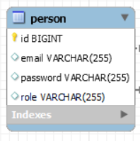
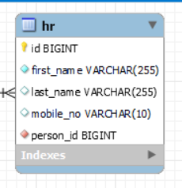
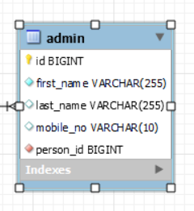
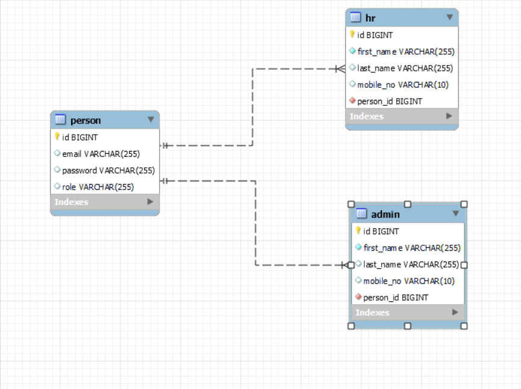

# Initial Development

## HR Management
 ### HR login
HR login will be protected by Spring Security. After successful login HR will be able to see ..

* HR DashBoard
* Job Posting
* Can take Actions

## Entity
### Person(USER):
Person entity will be a generic entity, that could be a Type of HR entity or Admin Entity.
* Table Structure

### HR Table: 
HR entity has one-to-one relationship with Person Entity and person_id is a foreign key in HR Table that refers to Person's Table primary key.
* Table Structure

### Admin Table:
It has also same one-to-one relationship with Person Table.

* Table Structure:

### Whole Relationship:

### Relationship
One-to-Many relationship (HR ---> Job)